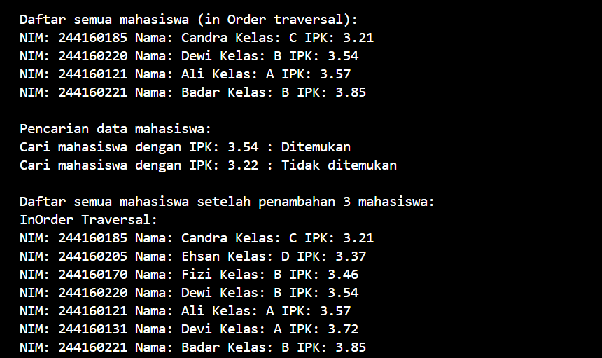

|  | Algoritma dan Struktur Data|
|--|--|
| Nama       |  Tri Desti Sasmita|
| Nim        |  244107020167|
| Kelas | TI-1H |
| Repository |[Link!] (https://github.com/Stridesti/AlgoritmaDan-StrukturData.git)|

# Jobsheet 14 Tree

## 14.2 Kegiatan Praktikum 1: Implementasikan Binary Search Tree menggunakan Linked List

### 14.2.1 Percobaan 1

Hasil Running
---
.png>)
---
.png>)
---

### 14.2.2 Pertanyaan Percobaan

1.  karena struktur dan aturan nilai node yang terurut memungkinkan algoritma pencarian mengeliminasi sebagian besar data yang tidak relevan secara cepat, berbeda dengan binary tree biasa yang tidak memiliki aturan pengurutan nilai

2.   atribut left dan right pada class Node berfungsi sebagai penghubung ke subpohon kiri dan kanan, yang memungkinkan pembentukan dan navigasi struktur pohon biner secara hierarkis. dan kegunaannya yaitu: left menunjuk ke anak kiri dari node saat ini, yang dalam konteks Binary Search Tree berisi nilai yang lebih kecil dari nilai node induk. right menunjuk ke anak kanan dari node saat ini, yang berisi nilai yang lebih besar dari nilai node induk.

3.  a. Untuk apakah kegunaan dari atribut root di dalam class BinaryTree?
    Kegunaan atribut root di dalam class BinaryTree adalah sebagai node akar (root node) yang menjadi titik awal atau pintu masuk untuk mengakses seluruh struktur pohon. Root ini adalah node paling atas yang tidak memiliki parent, dan dari sinilah proses traversal, pencarian, penyisipan, dan operasi lain pada pohon dimulai.
    
    b. Ketika objek tree pertama kali dibuat, apakah nilai dari root? 
    Ketika objek tree pertama kali dibuat, nilai dari root biasanya adalah null (kosong) karena pohon masih belum memiliki node apapun. Root akan diisi dengan node pertama yang dimasukkan ke dalam pohon, sehingga node tersebut menjadi akar dari pohon tersebut.

4.  Ketika tree masih kosong dan akan ditambahkan sebuah node baru
    proses yang terjadi adalah:

    Node baru tersebut langsung ditempatkan sebagai root (akar) pohon karena belum ada node lain di dalam tree.

    Atribut root yang awalnya bernilai null akan diisi dengan alamat node baru tersebut.

    Node baru ini diinisialisasi dengan nilai data yang dimasukkan, serta atribut left dan right diset ke null karena belum memiliki anak.
    Proses ini merupakan langkah awal dalam membangun pohon biner, di mana node pertama menjadi titik awal untuk operasi selanjutnya.

5.  Penjelasan Baris Program tersebut berfungsi untuk:
    Menyimpan node saat ini ke variabel parent sebelum bergerak ke anak kiri atau kanan.

    Membandingkan nilai ipk mahasiswa baru dengan node current untuk menentukan arah traversal (ke kiri jika lebih kecil, ke kanan jika lebih besar atau sama).

    Jika posisi anak kiri atau kanan kosong (null), maka node baru (newNode) ditempatkan di situ sebagai anak dari parent.

    Proses ini memastikan node baru disisipkan pada posisi yang tepat sesuai aturan Binary Search Tree.

6.  Langkah pada method delete() saat menghapus node dengan dua anak adalah:
Cari successor node, yaitu node dengan nilai terkecil di subpohon kanan node yang akan dihapus. Ganti nilai node yang akan dihapus dengan nilai successor tersebut.Hapus node successor yang kini menjadi duplikat, yang pasti memiliki paling banyak satu anak.Method getSuccessor() membantu dengan menemukan node penerus inorder ini secara efisien, sehingga penghapusan node dua anak dapat dilakukan tanpa merusak struktur Binary Search Tree.

## 14.3 Kegiatan Praktikum 2: Implementasi Binary Tree dengan Array

### 14.3.1 Tahapan Percobaan

Hasil Running
---

---

### 14.3.2 Pertanyaan Percobaan

1.  data: Merupakan array yang digunakan untuk menyimpan elemen-elemen
    node dari binary tree secara berurutan. Dengan menggunakan array, struktur pohon direpresentasikan secara linear, di mana posisi anak kiri dan kanan dari sebuah node dapat dihitung berdasarkan indeks node induk.

    idxLast: Menyimpan indeks terakhir yang terisi pada array data, yaitu posisi node terakhir yang sudah dimasukkan ke dalam tree. Atribut ini berguna untuk mengetahui batas data yang valid dan untuk menambah node baru pada posisi yang tepat di array.

2.  Kegunaan method populateData() adalah untuk mengisi atau menetapkan nilai-nilai array data dan indeks terakhir (idxLast) pada objek BinaryTreeArray. populateData() berfungsi sebagai metode untuk menginisialisasi atau mengisi data pohon dan batas indeks terakhir pada array yang merepresentasikan binary tree.

3.  Method traverseInOrder() digunakan untuk melakukan traversal (penelusuran) pohon secara in-order, yaitu salah satu cara standar dalam menjelajahi seluruh node dalam sebuah binary tree atau binary search tree (BST).

4.  Jika sebuah node binary tree disimpan di indeks 2 dalam array (dengan indeks mulai dari 0), maka posisi anak kiri (left child) dan anak kanan (right child) dari node tersebut dapat dihitung dengan rumus:
Left child index = 2 × 2 + 1 = 5
Right child index = 2 × 2 + 2 = 6
Jadi, anak kiri node di indeks 2 berada di indeks 5, dan anak kanannya berada di indeks 6 dalam array.

5.  Statement int idxLast = 6 berfungsi untuk menandai indeks terakhir yang berisi data valid dalam array dataMahasiswa27s. Ini berarti elemen-elemen dari indeks 0 sampai 6 sudah terisi dengan objek Mahasiswa27, sedangkan indeks setelahnya (7, 8, 9) berisi null atau kosong.Kegunaan idxLast adalah:
a. Menentukan batas data yang valid saat melakukan operasi pada binary tree yang diimplementasikan dengan array.
b. Menghindari akses ke indeks kosong atau di luar batas saat traversal atau manipulasi data pohon.
c. Memudahkan method populateData() untuk mengetahui seberapa banyak data yang harus diolah. idxLast = 6 menunjukkan bahwa ada 7 node mahasiswa yang aktif dan siap diproses dalam struktur pohon array tersebut.

6.  Indeks 2 * idxStart + 1 dan 2 * idxStart + 2 digunakan dalam pemanggilan rekursif karena merepresentasikan posisi anak kiri dan anak kanan dari sebuah node dalam struktur pohon biner yang disimpan secara linear dalam array.

## 14.4 Tugas Praktikum

Hasil Running
---

---

---

---

---